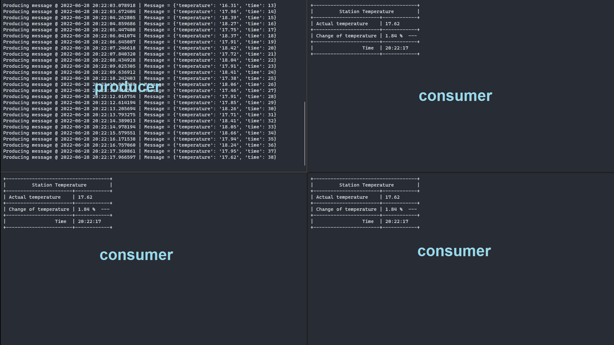

# Temperature Monitor using Kafka
This project is about to create a streaming of enriched data serialized, which contains temperature generated by sensors. Streaming is consumed by others threads in the same computer. This project use docker to deploy kafka.

## 1. Before start

- Install docker
- Install python
- Install pip
- Install kafka-python

## 2. Run project

- Clone this proyect on your computer.

### 2.1. Deploy kafka and topic

- Go to the same location of `docker-compose.yml` and run this code:
```bash
docker-compose -f docker-compose.yml up -d
```
- After both containers are running, execute this to be able to run commands inside kafka container:
```bash
docker exec -it kafka sh
```
- Now, inside kafka container we are going to create a topic named `message`:
```bash
kafka-topics.sh --create --zookeeper zookeeper:2181 --replication-factor 1 --partitions 1 --topic messages
```
- To be sure that topic was created, run this:
```bash
kafka-topics.sh --list --zookeeper zookeeper:2181
```
- You will be see `message` topic that we have just created. This is all that we do in this container.

### 2.2. Run producer and consumer

- Go to the folder of `producer.py` and `consumer.py` (Maybe you are already there). Run this:
```bash
python consumer.py
```
- In other terminal and in the same location, run this:
```bash
python producer.py
```
- Now you can see producer generating enriched data and consumer showing a simple dashboard with temperature, change of temperature and time.
  
## 3. Extra notes

- You can run multiples consumers in other terminal and you should see the same dashboard.
- If you run three consumer you have to see something like this:

